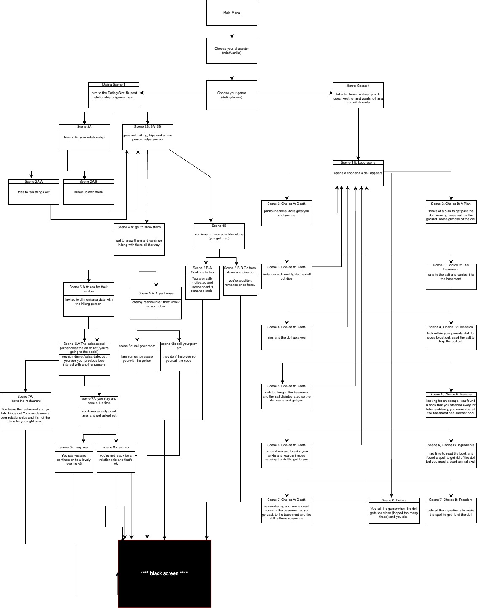
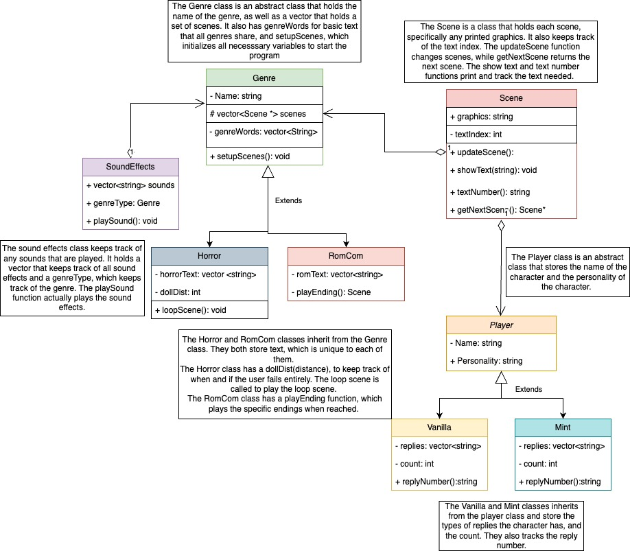

# My Favorite Story
 
Authors: [Khushi Chaudhari](https://github.com/khushi-04), [Aditi Thanekar](https://github.com/aditithanekar), [Ray Wong](https://github.com/xwRongx), [Sarah Pun](https://github.com/sarahpun)

## Project Description
Our concept for this project is that we want to create a RPG based on genre, giving the user the choice to live out their favorite storyline, whether that’s romance, horror, or comedy. We wanted to do a project that would be entertaining for us and for those who utilize it. It allows us to be creative artistically and technically. Many of us grew up playing role-playing games, and still do to this day. Because of all the influence from the world and technology around us, coming up with a concept that would be fun was entertaining in itself, and it allowed us to feel like we were kids again. Our goal with this project is to be able to recreate our memories and childhood with a RPG of our own!

We will be coding this project in C++ using the VSCode IDE. This project will include audio cues and effects alongside the terminal based gameplay. 

The project will take in user input by asking for keyboard input through std::cin. This means that the user will be presented with choices in the terminal, and asked to press keys on their keyboard to select a choice. The output of this project will consist of terminal based graphics (ASCII graphics), as well as text output in the terminal. We also plan to include audio based output, such as sound effects when a certain choice is made. 

Some features we plan on providing include:
* All storylines are text-based adventure style
* Audio based on the genre you choose, including sound effects
* ASCII graphics in the terminal- simple graphic “cutscenes”
* Options based on choosing a character and genre
* Different storyline and adventure based on character, genre, and choices

## User Interface Specification
### Navigation Diagram
This navigation diagram represents how our screen layout changes from the main menu to choose your character and genre, and split into how the storylines change for the dating storyline on the left as well as the looping horror story on the right side.
>  

### Screen Layouts
Click [here](https://docs.google.com/document/d/1xZE690FOioJzWJGLKPGApxL3kFQgQ7RXP86dCf6oQLs/edit?usp=sharing) to see our screen layout.

## Class Diagram
This is a UML class diagram describing our abstract Genre and Player classes as well as our Scene and Sound Effects main classes. The inherited classes of the Genre are the Horror and RomCom classes and the inherited classes of the Player are our two characters names Vanilla and Mint.
> 
 
# Phase III
> You will need to schedule a check-in for the second scrum meeting with the same reader you had your first scrum meeting with (using Calendly). Your entire team must be present. This meeting will occur on week 8 during lab time.
 
 > BEFORE the meeting you should do the following:
 > * Update your class diagram from Phase II to include any feedback you received from your TA/grader.
 > * Considering the SOLID design principles, reflect back on your class diagram and think about how you can use the SOLID principles to improve your design. You should then update the README.md file by adding the following:
 >   * A new class diagram incorporating your changes after considering the SOLID principles.
 >   * For each update in your class diagram, you must explain in 3-4 sentences:
 >     * What SOLID principle(s) did you apply?
 >     * How did you apply it? i.e. describe the change.
 >     * How did this change help you write better code?
 > * Perform a new sprint plan like you did in Phase II.
 > * You should also make sure that your README file (and Project board) are up-to-date reflecting the current status of your project and the most recent class diagram. Previous versions of the README file should still be visible through your commit history.
 
> During the meeting with your reader you will discuss: 
 > * How effective your last sprint was (each member should talk about what they did)
 > * Any tasks that did not get completed last sprint, and how you took them into consideration for this sprint
 > * Any bugs you've identified and created issues for during the sprint. Do you plan on fixing them in the next sprint or are they lower priority?
 > * What tasks you are planning for this next sprint.

 
 > ## Final deliverable
 > All group members will give a demo to the reader during lab time. ou should schedule your demo on Calendly with the same reader who took your second scrum meeting. The reader will check the demo and the project GitHub repository and ask a few questions to all the team members. 
 > Before the demo, you should do the following:
 > * Complete the sections below (i.e. Screenshots, Installation/Usage, Testing)
 > * Plan one more sprint (that you will not necessarily complete before the end of the quarter). Your In-progress and In-testing columns should be empty (you are not doing more work currently) but your TODO column should have a full sprint plan in it as you have done before. This should include any known bugs (there should be some) or new features you would like to add. These should appear as issues/cards on your Project board.
 > * Make sure your README file and Project board are up-to-date reflecting the current status of your project (e.g. any changes that you have made during the project such as changes to your class diagram). Previous versions should still be visible through your commit history. 
 
 ## Screenshots
 > Screenshots of the input/output after running your application
 ## Installation/Usage
 > Instructions on installing and running your application
 ## Testing
 > How was your project tested/validated? If you used CI, you should have a "build passing" badge in this README.
 
