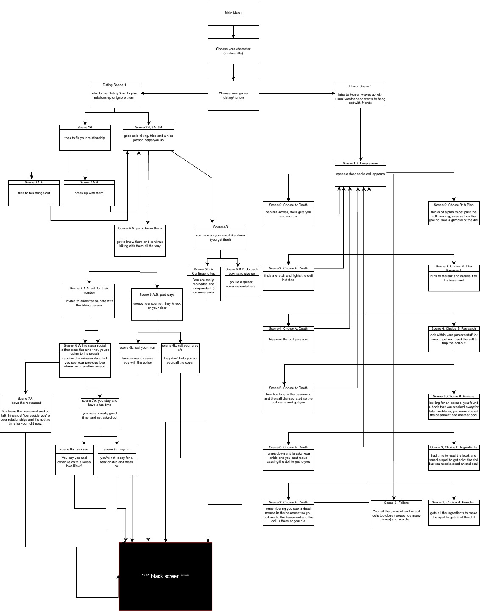
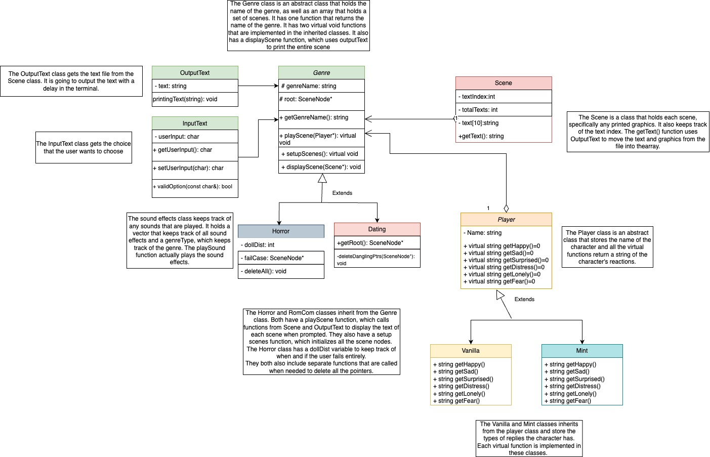

[](https://classroom.github.com/online_ide?assignment_repo_id=10872349&assignment_repo_type=AssignmentRepo)
# My Favorite Story
 
Authors: [Khushi Chaudhari](https://github.com/khushi-04), [Aditi Thanekar](https://github.com/aditithanekar), [Ray Wong](https://github.com/xwRongx), [Sarah Pun](https://github.com/sarahpun)

## Project Description
Our concept for this project is that we want to create a RPG based on genre, giving the user the choice to live out their favorite storyline, whether that’s romance, horror, or comedy. We wanted to do a project that would be entertaining for us and for those who utilize it. It allows us to be creative artistically and technically. Many of us grew up playing role-playing games, and still do to this day. Because of all the influence from the world and technology around us, coming up with a concept that would be fun was entertaining in itself, and it allowed us to feel like we were kids again. Our goal with this project is to be able to recreate our memories and childhood with a RPG of our own!

We will be coding this project in C++ using the VSCode IDE. This project will include text effects alongside the terminal based gameplay. 

The project will take in user input by asking for keyboard input through std::cin. This means that the user will be presented with choices in the terminal, and asked to press keys on their keyboard to select a choice. The output of this project will consist of terminal based graphics (ASCII graphics), as well as text output in the terminal.

Some features we plan on providing include:
* All storylines are text-based adventure style
* ASCII graphics in the terminal- simple graphic “cutscenes”
* Options based on choosing a character and genre
* Different storyline and adventure based on character, genre, and choices

## User Interface Specification
### Navigation Diagram
This navigation diagram represents how our screen layout changes from the main menu to choose your character and genre, and split into how the storylines change for the dating storyline on the left as well as the looping horror story on the right side.
>  

### Screen Layouts
Click [here](https://docs.google.com/document/d/1xZE690FOioJzWJGLKPGApxL3kFQgQ7RXP86dCf6oQLs/edit?usp=sharing) to see our screen layout.

## Class Diagram
This is a UML class diagram describing our abstract Genre and Player classes as well as our Scene main class. The inherited classes of the Genre are the Horror and RomCom classes and the inherited classes of the Player are our two characters names Vanilla and Mint.
> 
 
### SOLID Principles
* Single Responsibility: We created new classes called the OutputText and inputText. These are now in charge of printing and taking in text respectfully, instead of the Scene class doing so. This makes it so the Scene class only has a single responsibility instead of three. This change helped us write better code because it divided up the general task of outputting and inputting text into their own interfaces rather than redundantly implementing them for each Genre class. This way, it can be used by all the other classes.
* Liskov Substitution: We created virtual void functions in the Genre class as well as the Player class to allow the other classes to implement and replace the functions of the same purpose as the abstract classes. With the change of the virtual functions, it would allow the calls of the right functions in the other derived classes. 
* Open/Closed and Dependency Inversion: We made the two abstract functions to only contain basic information about the inherited classes. If another class were to inherit from these two abstract classes, the abstract class would not need to be modified in any way. Also, since the abstract classes no longer depend on the inherited classes (since the lower level classes don’t modify the higher level classes), this also now follows the dependency inversion principle. We were able to implement more classes that does not change the inherited classes but were able to motify the abstract classes. 
* Interface segregation: We have separate interfaces for our Dating and Horror genres, which helps us split them up and not have them depend on each other. For example, the Horror interface uses a dollDist variable which is not used in the RomCom interface because it does not need to use it even though they are both a genre. This is better than implementing a dollDist in Genre as a general Genre variable so that all the derived classes do not have to use it.
 
 ## Screenshots
 > Screenshots of the input/output after running your application
 ## Installation/Usage
To run **My Favorite Story**, clone this github repository on any linux based terminal with the capability of using git, cmake, and make. Run the following commands: 
   ```
   cmake .
   make
   bin/playMyFavoriteStory
   ```
And voilà! You will be running our game, which will prompt you for your preferred genre and character personality. Have fun!
 ## Testing
We tested our project using unit tests, and using the googletest submodule as a framework to validate the tests. In the folder called tests, we include all of our separate testing .cpp files for separate interfaces as well as a CMakeLists.txt file to have an executable to run all the tests. We run all the tests every time for our unit tests using the executable ./bin/runAllTests
